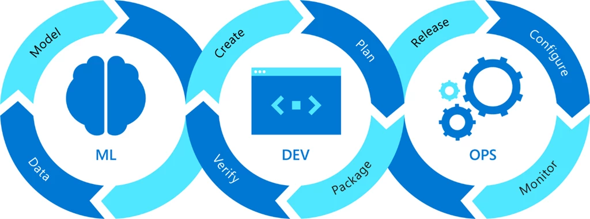

# MLOps project group 13

### Исходное ТЗ и особенности проекта
От условного заказчика поступило предложение на разработку кросплатформенного микросервисного API приложения.
Приложение должно быть оформлено в виде docker-образа и содержать предобученную модель, которая дает ответ на запрос к API веб-приложению.
Заказчику также необходимо, чтобы разработчик быстро реагировал на меняющийся датасет от заказчика, быстро предобрабатывал датасет, переобучивал модель и выдавал новый образ приложения.
На период поиска исполнителя, заказчик не предоставляет своего датасета и предлагает использовать любой датасет и модель.
Помимо docker-образа заказчик пожелал получить командные файлы для запуска контейнера и проверки работы приложения.
Для быстрого создания прототипа приложения и презентации его заказчику был взят учебный датасет Titanic из библиотеки Catboost.
Решение поставленной задачи было разделено на два блока: для разработчика и для заказчика.

### Предлагаемое решение в рамках проекта
Необходимо создать для заказчика:
```
1. Командные файлы для создания и запуска docker-контейнера.
2. Командный файл для тестирования работы API приложения.
```
Необходимо создать для разработчика:
```
1. Скрипты на python для получения датасета, его модификации, обучение и сохрание модели.
2. Скрипт для запуска API приложения на FastAPI.
3. Функциональные и модульные тесты для приложения.
4. Dockerfile для создания образа приложения с необходимым окружением.
5. Приложение будет автоматически собираться в пайплайне Jenkins.
6. Версионирование различный версий датасетов предполагается вести при помощи DVC.
```

### Структура проекта

```
.
├── ...
├── data                             # вспомогательный, примеры использования 
├── src                              # каталог с исполняемыми скриптами приложения
│   ├── api_app_titanic.py           # API приложение на FASTAPImodels
│   ├── dataset_titanic_modifed.py   # создание "плохого" датасета
│   ├── make_dataset_titanic.py      # сохранение датасета Titanic
│   └── model_titanic.py             # обучение модели на данных датасета Titanic
├── tests                            # unit tests
│   ├── api_app_test.py              # модульное тестирование API приложения
└── └── dataset_test.py              # функциональное тестирование предсказательной способности модели
./doker_container_run.bat            # запуск docker контейнера с приложением из образа (Windows)
./doker_container_run.sh             # запуск docker контейнера с приложением из образа (Unix)
./Dokerfile                          # файл для создания doker образа приложения
./Jenkinsfile                        # конвейер для автоматического развертывания приложения, 
                                       тестирования и сборки doker образа
./predict_titanic.bat                # командный файл для проверки работы API приложения (Windows)
./predict_titanic.sh                 # командный файл для проверки работы API приложения (Unix)
```

> [!NOTE]
Приложение собирается в docker контейнере. Сборка приложения, тестирование и создание docker образа происходит в
автоматическом режиме в `Jenkins` на основе файла сценария `Jenkinsfile`.

> [!IMPORTANT]
После создания docker образа приложения запускается командный файл `doker_container_run.bat (doker_container_run.sh)` для 
сборки и запуска docker контейнера с приложением. Приложение запускается на порту `8091`.

> [!TIP]
Для проверки работы предложения запускаются командные файлы: `predict_titanic.bat (predict_titanic.sh)`

## Команда

```
Аналитик данных – Ластин Максим
Инженер по машинному обучению - Красильников Михаил
Full Stack-разработчик – Казанцев Александр
Тестировщик – Граб Яков
Документалист/технический писатель – Кузнецов Иван

```

## Лицензия

_Python Software Foundation License_
